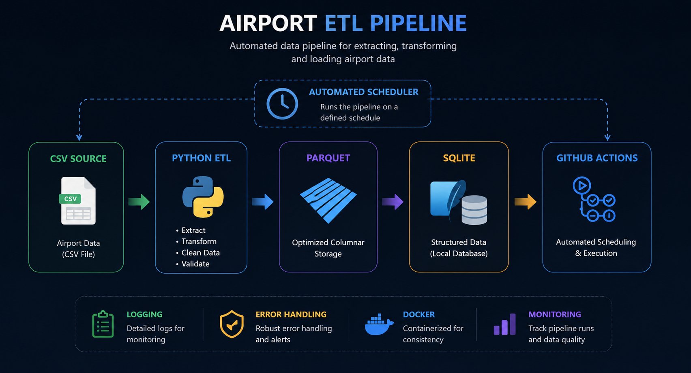
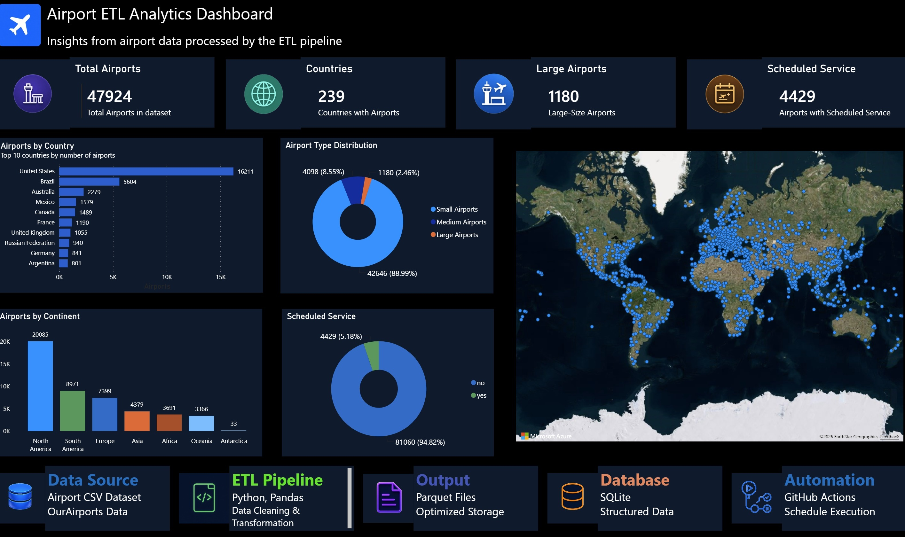

# Airport ETL Pipeline

Automated ETL pipeline built with Python to extract, clean, transform, and load airport data into Parquet storage.

## Project Overview

This project demonstrates a complete ETL workflow for airport data.

The pipeline extracts raw airport data, applies cleaning and transformation rules, exports optimized Parquet datasets, and supports automated execution through GitHub Actions.

The source dataset contains over 85,000 aviation facilities, including airports, heliports, seaplane bases, and other aviation locations. During the transformation process, the data is cleaned, filtered, and prepared for analytics and reporting.

The resulting dataset is used for reporting and visualization in Power BI.

## Live Dashboard

https://app.powerbi.com/view?r=eyJrIjoiYjdjY2Y1NzEtOWJiZC00YTZhLWJhNGUtYWI0ZWY4N2U0Y2EzIiwidCI6IjA1MjEzYjk4LTdiNzAtNDNlOS05YjVmLWVkYmMzODhmNjRkMCJ9

## Architecture



## Power BI Dashboard



## Highlights

- Built an end-to-end ETL pipeline with Python
- Processed 85,000+ airport records
- Applied data cleaning and transformation rules
- Exported optimized Parquet datasets
- Added logging and error handling
- Containerized with Docker
- Automated execution with GitHub Actions
- Published an interactive Power BI dashboard

## Technologies

- Python
- Pandas
- Parquet
- Docker
- GitHub Actions

## Run the pipeline once

```powershell
py src/main.py
```

## Run the automatic scheduler

The scheduler runs the ETL pipeline on a fixed interval.

```powershell
py src/scheduler.py
```

Optional environment variables:

- `SCHEDULE_EVERY_HOURS`: interval in hours, default `24`
- `RUN_ON_START`: run once immediately on startup, default `true`

Example:

```powershell
$env:SCHEDULE_EVERY_HOURS = "6"
$env:RUN_ON_START = "true"
py src/scheduler.py
```

## Docker

Build the image:

```powershell
docker build -t airport-etl-pipeline .
```

Run the ETL pipeline once:

```powershell
docker run --rm \
	-v ${PWD}/data:/app/data \
	-v ${PWD}/logs:/app/logs \
	-v ${PWD}/metadata:/app/metadata \
	airport-etl-pipeline
```

Run the scheduler inside Docker:

```powershell
docker run --rm \
	-e SCHEDULE_EVERY_HOURS=6 \
	-e RUN_ON_START=true \
	-v ${PWD}/data:/app/data \
	-v ${PWD}/logs:/app/logs \
	-v ${PWD}/metadata:/app/metadata \
	airport-etl-pipeline python src/scheduler.py
```
