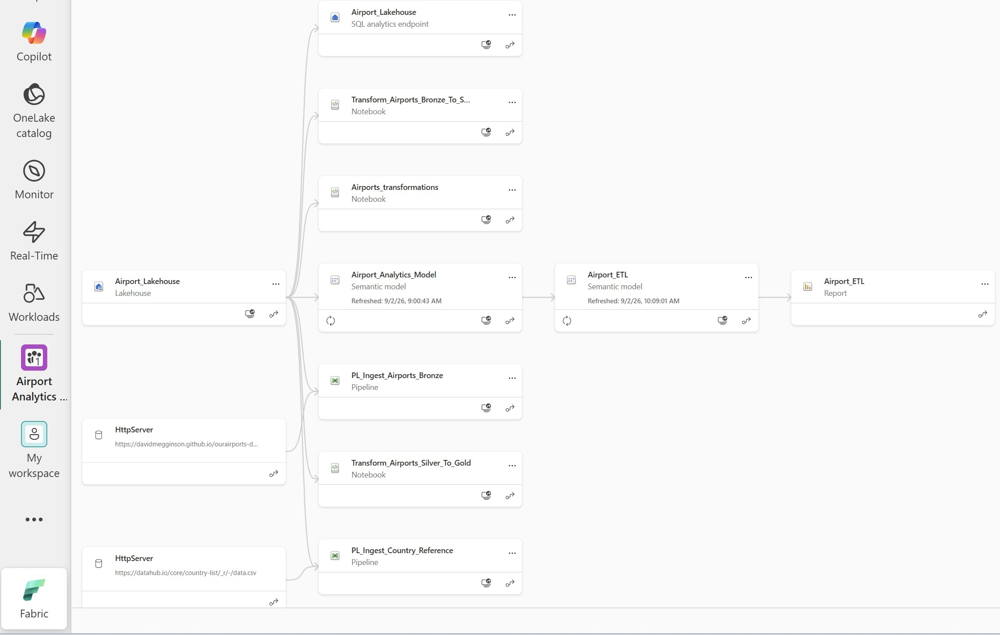
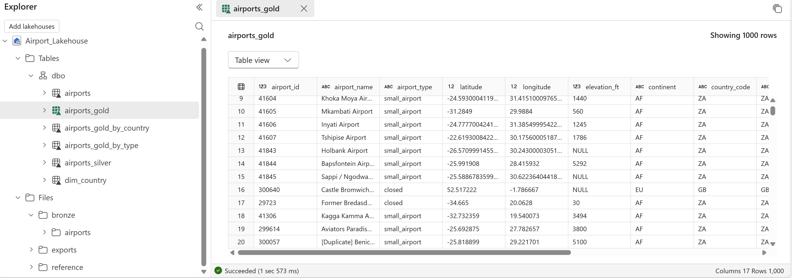
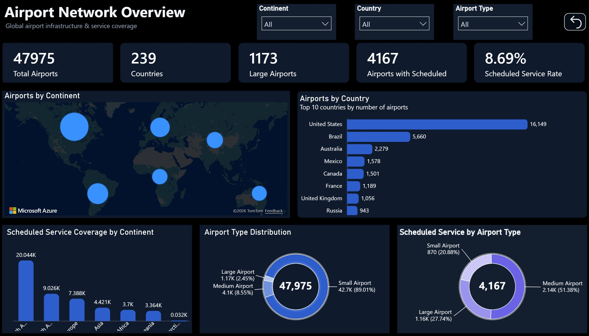

# Airport Analytics Platform

End-to-end airport analytics platform built with Microsoft Fabric, using Data Factory, Lakehouse, PySpark, Delta Lake, semantic modeling, and Power BI.

## Project Overview

This project demonstrates a modern end-to-end data engineering and analytics workflow built in Microsoft Fabric.

Airport data is ingested from the public OurAirports dataset through Microsoft Fabric Data Factory and stored in a Fabric Lakehouse using a Bronze–Silver–Gold architecture.

PySpark notebooks are used to clean, validate, standardize, and enrich more than 85,000 aviation facility records before producing analytics-ready Delta tables.

The curated data is then modeled for analytics and used to power an interactive Power BI dashboard focused on global airport infrastructure and scheduled-service coverage.

**Source → Ingestion → Lakehouse → Transformation → Gold Layer → Semantic Model → Power BI**

## Architecture

    OurAirports / HTTP
            ↓
    Microsoft Fabric Data Factory
            ↓
    Bronze Layer
    Raw files stored in Lakehouse
            ↓
    PySpark Notebook
            ↓
    Silver Layer
    Cleaned and standardized Delta tables
            ↓
    PySpark Notebook
            ↓
    Gold Layer
    Analytics-ready Delta tables
            ↓
    Semantic Model
            ↓
    Power BI Dashboard

## Live Dashboard

https://app.fabric.microsoft.com/view?r=eyJrIjoiMjZiZjMyNTEtZTE2ZC00NTcyLThlNjYtYmZkYjBkNDhjM2FhIiwidCI6IjA1MjEzYjk4LTdiNzAtNDNlOS05YjVmLWVkYmMzODhmNjRkMCJ9

## Fabric Lineage

The Fabric Lineage view shows how the source, pipelines, Lakehouse, notebooks, semantic models, and Power BI report are connected.

## Medallion Architecture

The Lakehouse implements a Bronze–Silver–Gold architecture.

- **Bronze:** raw airport data ingested from the source
- **Silver:** cleaned, validated, and standardized airport records
- **Gold:** curated analytics-ready tables used for reporting

## Power BI Dashboard

The final dashboard provides a global overview of airport infrastructure and scheduled-service coverage.

## Data Source

The project uses the public OurAirports dataset.

The source contains more than 85,000 aviation facilities, including:

- Airports
- Heliports
- Seaplane bases
- Balloonports
- Closed facilities
- Geographic attributes
- Operational attributes
- IATA and ICAO identifiers
- Scheduled-service information

## Data Ingestion

Microsoft Fabric Data Factory is used to ingest airport data from an HTTP source into the Fabric Lakehouse.

Main ingestion pipeline:

`PL_Ingest_Airports_Bronze`

Raw airport files are stored in:

`Files/bronze/airports/`

A second pipeline is used to ingest country reference data for enrichment.

Country reference pipeline:

`PL_Ingest_Country_Reference`

## Bronze Layer

The Bronze layer stores raw source data with minimal modification.

The airport CSV is ingested from the external HTTP source and preserved inside the Fabric Lakehouse.

This layer provides a reliable raw-data foundation for downstream transformations.

## Silver Layer

The Silver layer is created using PySpark notebooks.

Main transformations include:

- Schema validation
- Null analysis
- Duplicate validation
- Column standardization
- Data type cleanup
- Geographic field preparation
- Operational flag normalization
- Preparation for analytical modeling

Main Silver table:

`airports_silver`

## Gold Layer

The Gold layer contains curated Delta tables optimized for analytics and reporting.

Main tables:

- `airports_gold`
- `airports_gold_by_country`
- `airports_gold_by_type`
- `dim_country`

Gold-layer transformations include:

- Continent name enrichment
- Country name standardization
- Airport type classification
- Scheduled-service indicators
- IATA availability flags
- ICAO availability flags
- Country-level aggregations
- Airport-type aggregations

## Country Dimension

A dedicated country dimension is used to improve labeling and reporting.

Main fields include:

- `country_code`
- `continent`
- `country_name`
- `country_display_name`

The dimension also handles special OurAirports location codes such as:

- `XK` → Kosovo
- `XP` → Paracel Islands
- `ZZ` → Unknown / Invalid

## Semantic Model

A Power BI semantic model is built on top of the curated Gold data.

The model includes:

- Airport-level fact data
- Country dimension
- Country-level aggregations
- Airport-type aggregations
- Relationships
- DAX measures

Key measures include:

- Total Airports
- Countries
- Large Airports
- Airports with Scheduled Service
- Scheduled Service Rate

## Public Reporting Model

For the public portfolio report, curated Lakehouse data is accessed through the SQL Analytics Endpoint and loaded into an Import-mode Power BI semantic model.

This allows the dashboard to be published publicly while keeping the Microsoft Fabric Lakehouse architecture as the core data platform.

## Dashboard Metrics

The dashboard highlights:

- **47,975** operational airports
- **239** countries
- **1,173** large airports
- **4,167** airports with scheduled service
- **8.69%** scheduled service rate

The report also includes:

- Airports by continent
- Top countries by airport count
- Scheduled service coverage by continent
- Airport type distribution
- Scheduled service by airport type
- Interactive continent filter
- Interactive country filter
- Interactive airport-type filter

## Technologies

- Microsoft Fabric
- Fabric Data Factory
- Fabric Lakehouse
- PySpark
- Apache Spark
- Delta Lake
- SQL Analytics Endpoint
- Power BI
- DAX
- Power Query
- Git
- GitHub

## Key Skills Demonstrated

- End-to-end data pipeline development
- HTTP data ingestion
- Medallion architecture design
- Lakehouse implementation
- PySpark data transformation
- Delta Lake table management
- Data quality validation
- Dimensional modeling
- Semantic model development
- DAX measure creation
- Power BI dashboard development
- Data lineage analysis
- Pipeline orchestration
- Analytics-ready data modeling

## Project Outcome

This project evolved from a standalone ETL workflow into a complete Microsoft Fabric analytics platform.

The final solution demonstrates how raw external data can be ingested, stored in a Lakehouse, transformed through Bronze–Silver–Gold layers, modeled for analytics, and delivered through an interactive Power BI report.

The project focuses primarily on the data engineering workflow, with Power BI serving as the final analytical and visualization layer.
