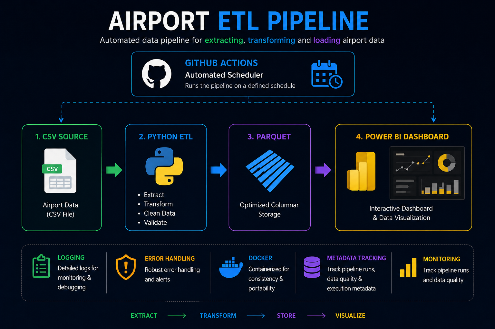

# Airport ETL Pipeline

Automated ETL pipeline built with Python to extract, clean, transform, and load airport data into SQLite and Parquet storage.

## Architecture



## Power BI Dashboard


## Highlights

- Built an end-to-end ETL pipeline with Python
- Processed 85,000+ airport records
- Exported optimized Parquet datasets
- Loaded structured data into SQLite
- Added logging and error handling
- Containerized with Docker
- Automated execution with GitHub Actions

## Technologies

- Python
- Pandas
- SQLite
- Parquet
- Docker
- GitHub Actions

## Run the pipeline once

## Run the pipeline once

```powershell
py src/main.py
```

## Run the automatic scheduler

The scheduler runs the ETL pipeline on a fixed interval.

```powershell
py src/scheduler.py
```

Optional environment variables:

- `SCHEDULE_EVERY_HOURS`: interval in hours, default `24`
- `RUN_ON_START`: run once immediately on startup, default `true`

Example:

```powershell
$env:SCHEDULE_EVERY_HOURS = "6"
$env:RUN_ON_START = "true"
py src/scheduler.py
```

## Docker

Build the image:

```powershell
docker build -t airport-etl-pipeline .
```

Run the ETL pipeline once:

```powershell
docker run --rm \
	-v ${PWD}/data:/app/data \
	-v ${PWD}/logs:/app/logs \
	-v ${PWD}/metadata:/app/metadata \
	airport-etl-pipeline
```

Run the scheduler inside Docker:

```powershell
docker run --rm \
	-e SCHEDULE_EVERY_HOURS=6 \
	-e RUN_ON_START=true \
	-v ${PWD}/data:/app/data \
	-v ${PWD}/logs:/app/logs \
	-v ${PWD}/metadata:/app/metadata \
	airport-etl-pipeline python src/scheduler.py
```
